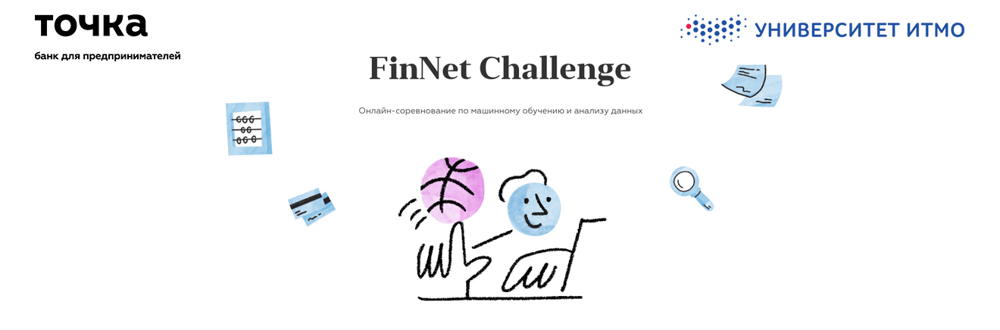
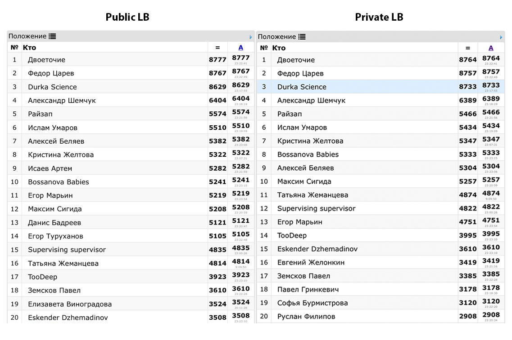

# [Finnet Challenge](https://job.tochka.com/challenge) 3rd place solution

The task of the competition was to find removed transactions between firms.  
Our final solution is blending of several different approaches:

1. [Recommended Systems approach](svd.ipynb) 
  Matrix factorization. We have used several SVDs with 400, 450 and 475 components. 
2. [Link Prediction approach](eda_node2vec.ipynb) 
  Node2Vec embeddings were used as features for logistic regression.
3. [Stacking & Blending](Stacking&Blending.ipynb) 
  Boostings with combinations of categorical features, node2vec embeddings and aggregation features.
4. [Using a leak of data](https://pbs.twimg.com/media/EHfFpaPXkAAXEtf?format=jpg&name=large)

# Competition results

